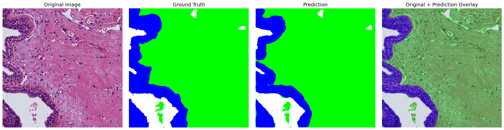

# HnE-Tumor-region-specific-segmentation-model

# Breast

NIPA repogitory를 참고로 데이터를 구축하였으며 기존 데이터셋과 다르게 클래스를 Tumor, non-Tumor 구분에 Specific하게 수정을 진행함

## Integrated Class

통합 클래스는 기존 여러개로 나뉜 클래스를 통합하여 4개의 클래스로 진행하여 Tumor, non-Tumor 영역 분할에 많은 가중치를 갖게 함.

### 클래스 통합 예시

```python
integrated_class={
    "Background":[],
    "Stroma": ["Background","NT_stroma", "NT_immune"],
    "Non_Tumor": ["NT_epithelial"],
    "Tumor": ["Tumor", "TP_invasive", "TP_in_situ"],
}
```

### Background

다음과 같은 작업을 통하여 기존 조직과 background 영역의 경계정확성을 높힘.

```python
background_preprocessing_mask=np.where(np.std(image, axis=2)>10,255,0).astype(np.uint8)
kernel = cv2.getStructuringElement(cv2.MORPH_ELLIPSE, (11,11))
background_preprocessing_mask=cv2.morphologyEx(background_preprocessing_mask, cv2.MORPH_CLOSE, kernel)
background_preprocessing_mask=np.where(background_preprocessing_mask==0,1,0).astype(np.uint8) 
```

## **Prediction Visualization**




## **Model Performance**

### BREAST TUMOR SEGMENTATION - TEST SET PERFORMANCE EVALUATION

## ✅ Overall Performance

- **Pixel Accuracy:** `0.9324 ± 0.0723`
    - 95% CI: `[0.9293 – 0.9354]`
- **Mean Dice Score (mDSC):** `0.9049 ± 0.0147`
- **Mean IoU (mIoU):** `0.8556 ± 0.0110`

---

## 📊 Dice Score per Class

| Class | Mean | Std | 95% CI | Min | Max |
| --- | --- | --- | --- | --- | --- |
| Background | 0.9102 | 0.0816 | [0.9067 – 0.9137] | 0.0000 | 0.9957 |
| Stroma | 0.9215 | 0.1172 | [0.9165 – 0.9265] | 0.0501 | 0.9986 |
| Non-Tumor | 0.8812 | 0.2535 | [0.8704 – 0.8920] | 0.0000 | 1.0000 |
| Tumor | 0.9067 | 0.1770 | [0.8992 – 0.9143] | 0.0000 | 1.0000 |

---

## 📊 IoU (Jaccard Index) per Class

| Class | Mean | Std | 95% CI | Min | Max |
| --- | --- | --- | --- | --- | --- |
| Background | 0.8435 | 0.1129 | [0.8387 – 0.8483] | 0.0000 | 0.9915 |
| Stroma | 0.8706 | 0.1516 | [0.8641 – 0.8770] | 0.0257 | 0.9972 |
| Non-Tumor | 0.8467 | 0.2647 | [0.8354 – 0.8580] | 0.0000 | 1.0000 |
| Tumor | 0.8615 | 0.2034 | [0.8528 – 0.8701] | 0.0000 | 1.0000 |

---

### Confusion Matrix


### Visualize metrics per class


## 📝 Key Observations

- 전체 **Pixel Accuracy 93.2%**, **mDSC 0.905**, **mIoU 0.856**으로 안정적인 segmentation 성능 확인됨.
- Tumor class Dice: **0.9067**, IoU: **0.8615** → 종양 영역에서도 높은 정합도 유지.
- Non-Tumor 및 Tumor 클래스에서 **min=0 케이스 존재**, 일부 실패 샘플 존재 → hard case 분석 필요.
- Class 간 분산(Std)이 비교적 큰 편 → tissue heterogeneity 및 boundary ambiguity 영향으로 추정됨.
- confusion matrix를 확인 결과 Tumor, non-Tumor의 영역 구별 혼란은 크지 않은 것으로 보아 stroma와 Tumor영역간의 경계 차이로 의심됨.

# Stomach

NIPA repogitory를 참고로 데이터를 구축하였으며 기존 데이터셋과 다르게 클래스를 Tumor, non-Tumor 구분에 Specific하게 수정을 진행함

## Integrated Class

통합 클래스는 기존 여러개로 나뉜 클래스를 통합하여 4개의 클래스로 진행하여 Tumor, non-Tumor 영역 분할에 많은 가중치를 갖게 함.

### 클래스 통합 예시

```python
integrated_class={
    "Background":[],
    "Stroma":["Background","NT_stroma","NT_Muscle","NT_immune"],
    "Non_Tumor":["NT_epithelial","NT_gastritis","NT_intestinal_metaplasia"],
    "Tumor":["Tumor","Tumor_diffuse","Tumor_intestinal"]
}
```

### Background

다음과 같은 작업을 통하여 기존 조직과 background 영역의 경계정확성을 높힘.

```python
background_preprocessing_mask=np.where(np.std(image, axis=2)>10,255,0).astype(np.uint8)
kernel = cv2.getStructuringElement(cv2.MORPH_ELLIPSE, (11,11))
background_preprocessing_mask=cv2.morphologyEx(background_preprocessing_mask, cv2.MORPH_CLOSE, kernel)
background_preprocessing_mask=np.where(background_preprocessing_mask==0,1,0).astype(np.uint8) 
```

## **Prediction Visualization**


## **Model Performance**

### STOMACH TUMOR SEGMENTATION - TEST SET PERFORMANCE EVALUATION

## ✅ Overall Performance

- **Pixel Accuracy:** `0.9065 ± 0.0685`
    - 95% CI: `[0.9023 – 0.9106]`
- **Mean Dice Score (mDSC):** `0.8534 ± 0.0794`
- **Mean IoU (mIoU):** `0.7899 ± 0.0963`

---

## 📊 Dice Score per Class

| Class | Mean | Std | 95% CI | Min | Max |
| --- | --- | --- | --- | --- | --- |
| Background | 0.8525 | 0.1259 | [0.8450 – 0.8601] | 0.0000 | 1.0000 |
| Stroma | 0.9041 | 0.1048 | [0.8978 – 0.9104] | 0.0661 | 0.9994 |
| Non-Tumor | 0.9321 | 0.1958 | [0.9203 – 0.9438] | 0.0000 | 1.0000 |
| Tumor | 0.7251 | 0.3315 | [0.7052 – 0.7450] | 0.0000 | 1.0000 |

---

## 📊 IoU (Jaccard Index) per Class

| Class | Mean | Std | 95% CI | Min | Max |
| --- | --- | --- | --- | --- | --- |
| Background | 0.7599 | 0.1581 | [0.7505 – 0.7694] | 0.0000 | 1.0000 |
| Stroma | 0.8382 | 0.1414 | [0.8297 – 0.8467] | 0.0342 | 0.9989 |
| Non-Tumor | 0.9106 | 0.2098 | [0.8980 – 0.9232] | 0.0000 | 1.0000 |
| Tumor | 0.6509 | 0.3202 | [0.6317 – 0.6701] | 0.0000 | 1.0000 |

---

### Confusion Matrix


### Visualize metrics per class


## 📝 Key Observations

- 전체 **Pixel Accuracy 90.7%**, **mDSC 0.853**, **mIoU 0.790**으로 breast 대비 전반적 성능 저하 확인됨.
- Tumor Dice **0.7251**, IoU **0.6509**로 종양 영역 분할 성능이 상대적으로 낮음.
- Tumor class의 **표준편차(Std)**가 매우 큼 → sample-wise variability 심함.
- Non-Tumor 및 Stroma는 높은 Dice 유지 → 종양 boundary ambiguity 및 gastric tissue heterogeneity 영향으로 추정됨.
- Min=0 케이스 존재 → hard failure case 분석 필요.